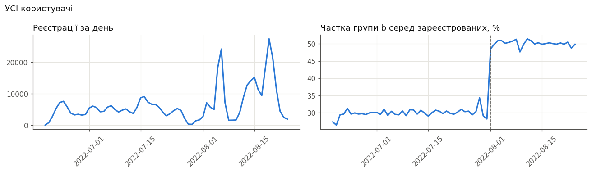
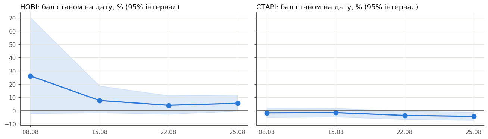

# Тестове завдання Middle BI Analyst

Три завдання: атрибуція реєстрацій (R), оцінка A/B тесту частоти імейлів (SQL + Python), дашборд для CEO (Tableau).

| Завдання | Відповідь |
|---|---|
| [1. Атрибуція](#завдання-1-атрибуція-реєстрацій) | Не атрибутується 13% реєстрацій google, 6% facebook, 22% tiktok і близько 0% snapchat. |
| [2. A/B тест](#завдання-2-оцінка-ab-тесту-частоти-імейлів) | Частіші імейли — лише новим користувачам: у них росте активність. Старим частота шкодить. Тест для нових продовжити, щоб перевірити виручку. |
| [3. Дашборд](#завдання-3-дашборд) | — |

---

## Завдання 1. Атрибуція реєстрацій

**Відповідь:**

| Джерело | Не атрибутується | Діапазон (95%) |
|---|---|---|
| google | 12,7% | 12,5–13,0% |
| facebook | 6,1% | 4,6–7,5% |
| tiktok | 21,7% | 18,7–25,3% |
| snapchat | ≈ 0% | 0–12% |

### 1. Ідея
- Дані — реєстрації по днях: атрибутовані з кожного джерела і загальна кількість неатрибутованих, без джерела.
- Джерела запускались по черзі: google — з дня 1, facebook — 107, tiktok — 126, snapchat — 140.
- З кожним запуском неатрибутованих стає більше. Приріст після запуску — це внесок нового джерела.


### 2. Розрахунок — ланцюжком по періодах
1. **Дні 1–106, лише google:** усі неатрибутовані — його. 3 340 / (22 882 + 3 340) = **12,7%**.
2. **Дні 107–125, + facebook:** з 545 неатрибутованих google за своєю часткою дає 447. Решта 98 — facebook: 98 / (1 526 + 98) = **6,1%**.
3. **Дні 126–139, + tiktok:** віднімаємо внесок google і facebook, решта — tiktok.
4. **Дні 140–153, + snapchat:** так само.

```r
# у періоді нового джерела віднімаємо очікуване від старих; решта — від нового
for (i in seq_along(sources)) {
  new_source <- sources[i]
  p <- totals[totals$period == i, ]
  expected <- 0
  for (s in names(shares)) {
    expected <- expected + expected_unattributed(p[[s]], shares[[s]])
  }
  rest <- p$unattributed - expected
  shares[new_source] <- rest / (p[[new_source]] + rest)
}
```

**Діапазон:** 2 000 разів перебираємо дні всередині періодів і перераховуємо ланцюжок.

### 3. Перевірка
Ті самі частки, підібрані однією регресією по всіх днях одразу (без ланцюжка).

| Джерело | Ланцюжок | Регресія |
|---|---|---|
| google | 12,7% | 12,7% |
| facebook | 6,1% | 6,4% |
| tiktok | 21,7% | 20,8% |
| snapchat | −7,0% | −0,4% |

**Висновок:** для google, facebook і tiktok способи сходяться (різниця ≤ 1 в.п.). Для snapchat обидва дають від'ємну частку: за 14 днів її не відрізнити від нуля.

### Примітки
- *⚠ З 107-го по 147-й день `facebook` рівно дорівнює `google / 2`. Тому частка facebook спирається на частку google з днів 1–106.*
- *⚠ Метод припускає, що всі неатрибутовані — з реклами. «Органіку» на цих даних надійно відділити не вдалося.*
- День 12 виключено: усі колонки = 0, тобто даних нема.

Код: [`task1/attribution.R`](task1/attribution.R). Хід рішень: [`hypotheses/t1-attribution.md`](hypotheses/t1-attribution.md).

---

## Завдання 2. Оцінка A/B тесту частоти імейлів

**Рекомендація:** надсилати імейли вдвічі частіше лише **новим** користувачам; **старим** лишити частоту як є; тест для нових продовжити, щоб перевірити виручку.

**Чому:** нові з частішими імейлами надійно активніші (+6,5% активних днів), але зростання виручки не доведене. Старі — надійно платять і заходять менше.

### 1. Як влаштований тест
Група a — 1 імейл на 3–4 дні, група b — удвічі частіше. Тест з 01.08.2022, оцінка на 25.08.2022.

| | Старі | Нові |
|---|---|---|
| Реєстрація | до 01.08 | 01.08–19.08 |
| Поділ a / b | 70 / 30 | 50 / 50 |
| Частіші імейли в b | з 01.08 | з дня реєстрації |
| Зі згодою на імейли, a / b | 47 469 / 20 345 | 34 273 / 34 237 |
| Що порівнюємо | 01–25.08 проти бази 18–31.07 | перші 7 днів від реєстрації |

- Імейли отримують лише ті, хто дав згоду (35% користувачів). Без згоди — **контроль**: у них ефекту бути не може.
- Нові, зареєстровані 20–24.08, не оцінюються: у них менше 7 днів даних.

**Висновок:** це два різні експерименти — старим частоту змінили посеред користування, нові отримали її з першого дня. Аналізуємо їх окремо.

### 2. Огляд даних
**Поділ коректний:** частка b — 30,0% у старих і 50,2% у нових, як задумано; згода на імейли — 35% в обох групах.

**Оплат 14.08 і 15.08 нема**, хоча візити звичайні — це втрата даних.


**Реєстрації нерівномірні:** піки 05–06.08 і 18–20.08; частка b стрибає з 30% до 50% саме 01.08.



**Старі групи b активніші ще до тесту** (липень, реєстрація до 01.07) — і серед тих, хто імейлів не отримує:

| Липень | a | b | b проти a |
|---|---|---|---|
| Виручка, зі згодою | 12,3 | 16,1 | +31% |
| Виручка, без згоди | 10,9 | 13,0 | +19% |
| Візити, без згоди | 1,47 | 1,55 | +5% |

**Інше:** 10% платників дають 51% виручки; country_code і default_os жорстко зв'язані (4 комбінації); через тиждень після реєстрації заходить 14% користувачів.

**Висновок — що це змінює в аналізі:**
- 14–15.08 не входять у виручку в обох групах.
- Старих порівнюємо за приростом відносно бази, а не за рівнем, — інакше давню перевагу b приписали б імейлам.
- Виручку понад 99,9-й перцентиль рахуємо на рівні порогу (зачіпає 59–67 людей і 1,1–1,4% виручки).
- Нових порівнюємо за однакові 7 днів від реєстрації.

### 3. Як оцінювали
- **Метрики на користувача:** виручка, чи платив, активні дні, прочитані епізоди. Рахуються в SQL (DuckDB прямо по csv), звірка з сирими даними — 12 перевірок, усі з нульовою різницею.
- **Ефект** = (середнє b − середнє a) / середнє a, %.
- **Бал** = 0,5 × виручка + 0,2 × частка платників + 0,3 × активні дні — одна оцінка з кількох метрик; ваги задані до розрахунку.
- **CUPED для старих:** від метрики в тесті віднімається частина, яку можна передбачити за базою. Так прибирається давня перевага групи b.
- **Діапазон** — бутстреп: 10 000 разів тягнемо людей із поверненням і перераховуємо все.
- **Правило рекомендації, записане до розрахунку:** бал надійно > 0 і активність не впала → частіші імейли; активність надійно впала → не частіше; ефекти нових і старих протилежні → окремі рекомендації.

```sql
-- виручка кожної людини за її період, без днів з втраченими оплатами
sum(t.amount) filter (where t.date between w.test_start and w.test_end
                        and t.date not in (date '2022-08-14', date '2022-08-15')) as revenue
```

```python
# CUPED: прибираємо різницю між групами, яка була ще до тесту
theta = np.cov(x, y)[0, 1] / np.var(x, ddof=1)   # на скільки більше в тесті, якщо в базі на 1 більше
mean_a -= theta * (a[m + "_base"].mean() - x.mean())
mean_b -= theta * (b[m + "_base"].mean() - x.mean())
```

### 4. Результат
Зміна в групі b порівняно з a, %; у дужках — 95% діапазон; **жирне** — діапазон не зачіпає 0.

| | Виручка | Платники | Активні дні | Епізоди | Бал |
|---|---|---|---|---|---|
| **Нові**, 7 днів | +6,0 (−3,4; +16,5) | +2,5 (−4,1; +9,4) | **+6,5 (+5,8; +7,2)** | **+6,2 (+4,5; +8,1)** | +5,5 (−0,4; +11,8) |
| **Старі**, 01–25.08 | **−7,1 (−12,0; −1,8)** | +1,0 (−1,4; +3,4) | **−3,3 (−6,1; −0,4)** | **−12,3 (−15,8; −8,7)** | **−4,3 (−7,3; −1,2)** |
| **Разом** | | | | | +0,6 (−2,7; +4,2) |


- Контроль без згоди — ефекту нема, як і має бути (праворуч на графіку).
- Розрізи країна × ОС: надійний лише один — старі на iOS, бал −8,2% (−12,5; −3,5).

**Висновок:** нові стали активнішими; бал нових +5,5% — на межі доведеного (p = 0,07). Старі надійно втратили у виручці, активності й читанні. «Разом» ≈ 0 лише тому, що плюс і мінус гасять одне одного.

### 5. Динаміка
**Нові, перший тиждень:** у групі b повертається на 7–12% більше людей щодня; накопичена виручка b трохи вище, але не надійно.


**Нові, дні 0–17** (реєстрація 01–07.08): перевага b згасає, але нижче a не падає; у днях 7–17 активних днів на 4,3% більше (+1,0; +7,7).


**Старі, по днях** (база 18–31.07 = 100): криві активності a і b близькі, виручка b після 01.08 нижча.


**Висновок:** приріст активності нових не зникає після першого тижня і не переходить у відтік. У старих найпомітніше падає виручка; активність за період нижча на 3% — по днях це майже не видно.

### 6. Відповіді на додаткові питання
1. **Чи достатньо даних?** Для старих — так. Для нових — ні: щоб надійно побачити бал +5,5%, потрібно ~86 тис. людей на групу, а є 34 тис.
2. **Чи можна було закрити тест раніше?** Ні. Тест мав фіксований термін, а закриття «щойно стало значущим» збільшує шанс хибного висновку. До того ж у старих ефект став надійно від'ємним лише з 22.08, у нових — не став.

   

3. **Чи варто застосувати CUPED?** Так, для старих: похибка балу менша втричі (4,7 → 1,6), і CUPED прибирає хибний плюс виручки (+6,9% без нього, −7,1% з ним). Для нових неможливий — у них нема даних до тесту.
4. **Які дані допомогли б оцінити тест швидше?** Події самих імейлів — відправки, відкриття, кліки, відписки: реакцію на них видно в перші дні, раніше за виручку.

### Примітки
- *⚠ Даних про відписки нема: ризик втоми від розсилки видно лише через активність.*
- *⚠ Тест тривав 25 днів; частина негативу старих може бути реакцією на різку зміну частоти.*
- Критерії, метрики й правило рішення записані до розрахунку: [`hypotheses/t2-ab-test.md`](hypotheses/t2-ab-test.md).

Код: [`task2/sql/`](task2/sql), [`task2/ab_test.ipynb`](task2/ab_test.ipynb).

---

## Завдання 3. Дашборд
—

---

## Як відтворити
**Дані в репозиторій не входять.** Покласти:
- `task1(attribution).csv` → `task1/`;
- вміст архіву A/B тесту (`users.csv`, `transactions.csv`, `reading_log.csv`, `visits.csv`, `comics.csv`) → `task2/data/`.

**Залежності:** R з `dplyr`, `tidyr`, `ggplot2`; Python з `duckdb`, `pandas`, `numpy`, `scipy`, `statsmodels`, `matplotlib`, `jupyter`.

**Запуск з кореня репозиторію:**
```bash
Rscript task1/attribution.R
```
```bash
jupyter nbconvert --to notebook --execute --inplace task2/ab_test.ipynb
```
