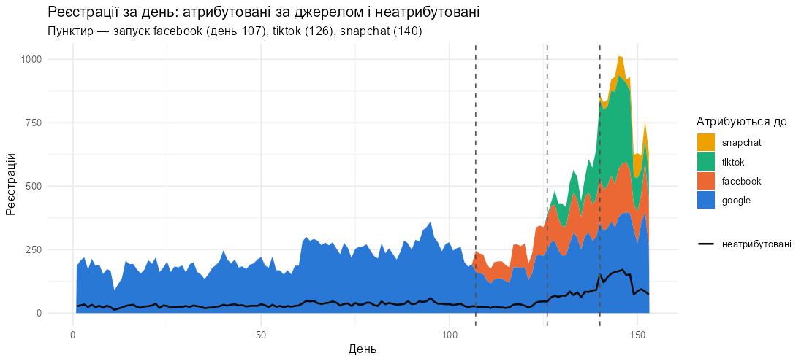
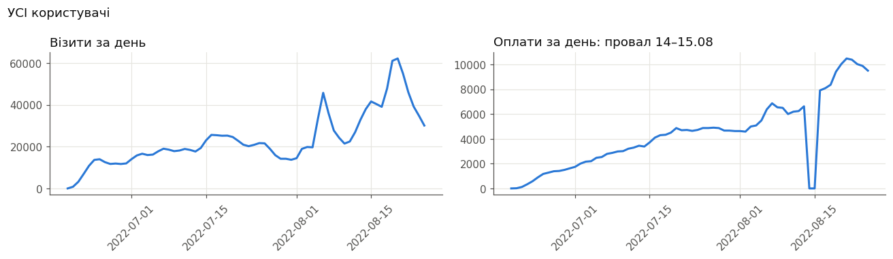
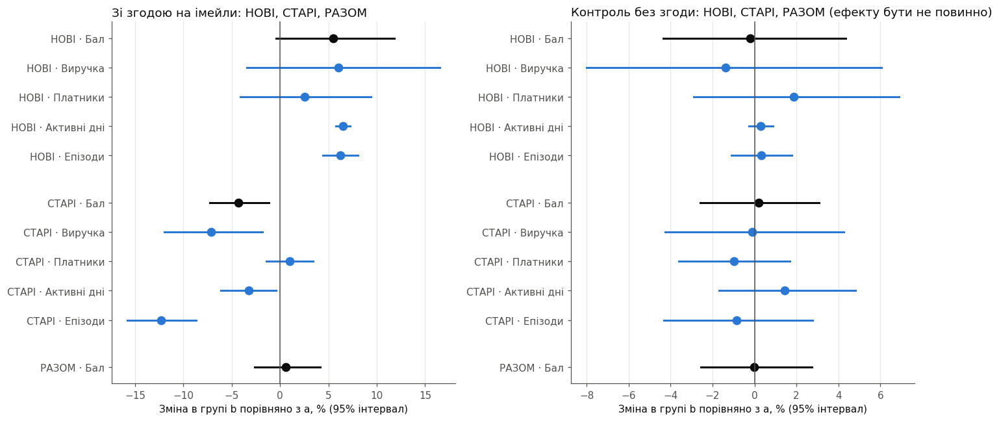
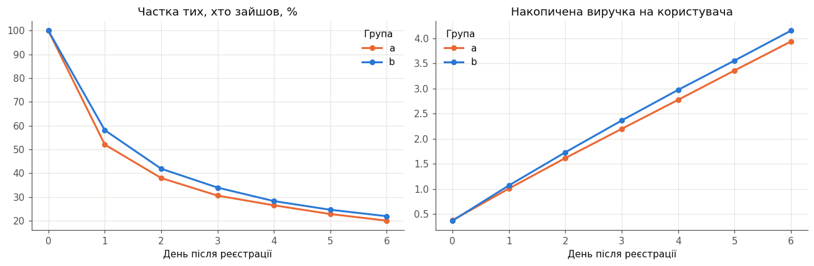
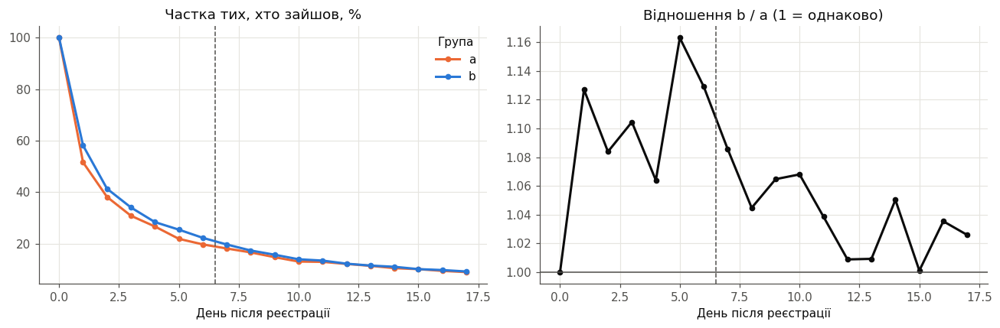
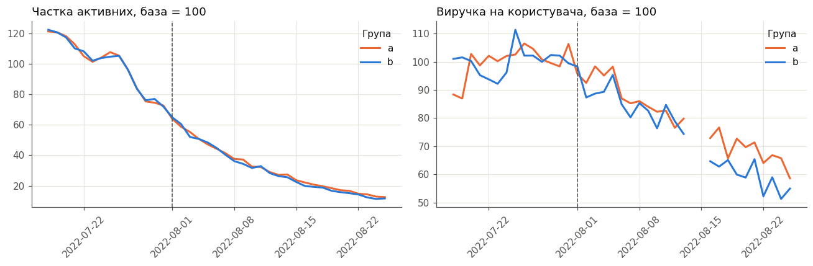
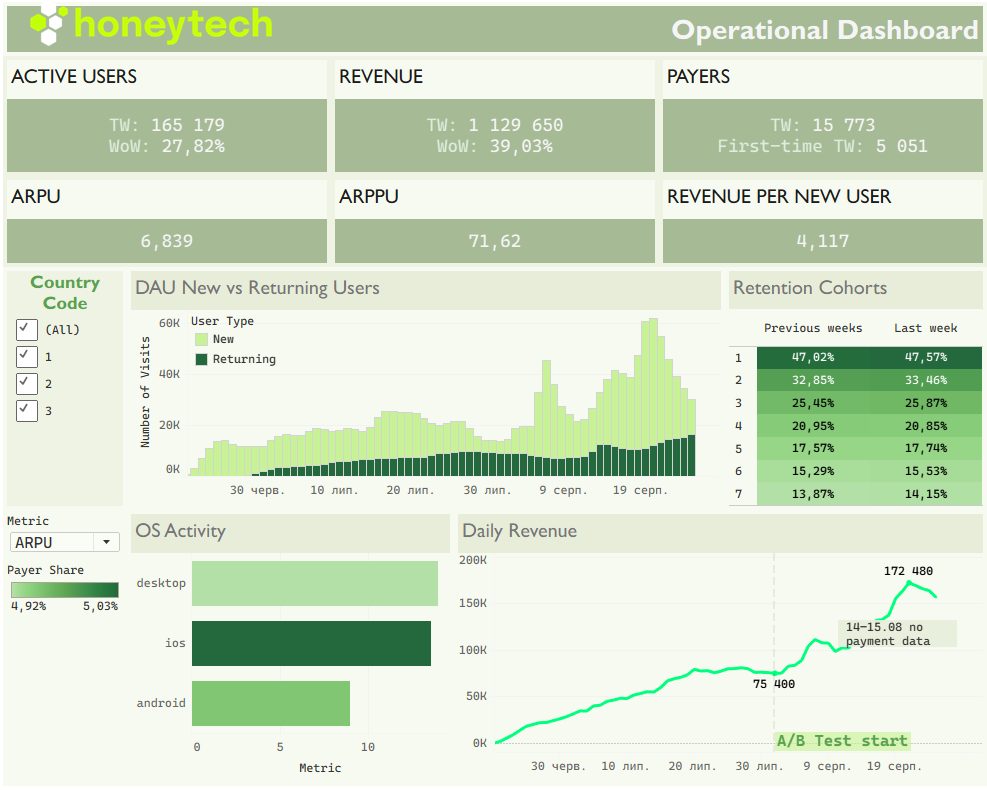

# Тестове завдання Middle BI Analyst

Три завдання: атрибуція реєстрацій (R), оцінка A/B тесту частоти імейлів (SQL + Python), дашборд для CEO (Tableau).

| Завдання | Відповідь |
|---|---|
| [1. Атрибуція](#завдання-1-атрибуція-реєстрацій) | Не атрибутується 13% реєстрацій google, 6% facebook, 22% tiktok і близько 0% snapchat. |
| [2. A/B тест](#завдання-2-оцінка-ab-тесту-частоти-імейлів) | Частіші імейли — лише новим користувачам: у них доведено зросла активність. Старим частота шкодить. Експеримент для нових продовжити, щоб перевірити виручку. |
| [3. Дашборд](#завдання-3-дашборд) | [Операційний дашборд для CEO](https://public.tableau.com/views/test-task-Honey/OperationalDashboard): стан за тиждень, на чому тримається активність, чи лишаються нові, де гроші. |

---

## Завдання 1. Атрибуція реєстрацій

**Відповідь:**

| Джерело | Не атрибутується | 95% CI |
|---|---|---|
| google | 13% | 12,5–13% |
| facebook | 6% | 5–7% |
| tiktok | 22% | 19–25% |
| snapchat | ≈ 0% | 0–12% |

### 1. Ідея
- Дані — реєстрації по днях: атрибутовані з кожного джерела і загальна кількість неатрибутованих, без джерела.
- Джерела запускались по черзі: google — з дня 1, facebook — 107, tiktok — 126, snapchat — 140.
- З кожним запуском неатрибутованих стає більше. Приріст після запуску — це внесок нового джерела.



### 2. Розрахунок — ланцюжком по періодах
1. **Дні 1–106, лише google:** усі неатрибутовані — його. 3 340 / (22 882 + 3 340) = **13%**.
2. **Дні 107–125, + facebook:** з 545 неатрибутованих google за своєю часткою дає 447. Решта 98 — facebook: 98 / (1 526 + 98) = **6%**.
3. **Дні 126–139, + tiktok:** віднімаємо внесок google і facebook, решта — tiktok.
4. **Дні 140–153, + snapchat:** так само.

```r
# у періоді нового джерела віднімаємо очікуване від старих; решта — від нового
for (i in seq_along(sources)) {
  new_source <- sources[i]
  p <- totals[totals$period == i, ]
  expected <- 0
  for (s in names(shares)) {
    expected <- expected + expected_unattributed(p[[s]], shares[[s]])
  }
  rest <- p$unattributed - expected
  shares[new_source] <- rest / (p[[new_source]] + rest)
}
```

**95% CI (довірчий інтервал)** — межі, у яких з імовірністю 95% лежить справжнє значення. Рахуємо бутстрепом: 2 000 разів перебираємо дні всередині періодів і перераховуємо ланцюжок; CI — 2,5-й і 97,5-й перцентилі результатів.

```r
# 2 000 разів: у кожному періоді набираємо стільки ж днів із поверненням і перераховуємо ланцюжок
draws <- replicate(n_boot, {
  resampled <- d |>
    group_by(period) |>
    slice_sample(prop = 1, replace = TRUE) |>
    ungroup()
  chain_shares(resampled)
})
apply(draws, 1, quantile, c(0.025, 0.975))   # межі середніх 95% для кожного джерела
```

### 3. Перевірка
Ті самі частки, підібрані однією регресією по всіх днях одразу (без ланцюжка).

| Джерело | Ланцюжок | Регресія |
|---|---|---|
| google | 13% | 13% |
| facebook | 6% | 6% |
| tiktok | 22% | 21% |
| snapchat | −7% | −0,4% |

**Висновок:** для google, facebook і tiktok способи сходяться (різниця ≤ 1 в.п.). Для snapchat обидва дають від'ємну частку: за 14 днів її не відрізнити від нуля.

### Примітки
- *Метод припускає, що всі неатрибутовані — з реклами. «Органіку» на цих даних надійно відділити не вдалося.*
- День 12 виключено: усі колонки = 0, тобто даних нема.

Код: [`task1/attribution.R`](task1/attribution.R).

---

## Завдання 2. Оцінка A/B тесту частоти імейлів

**Рекомендація:** **новим** — імейли вдвічі частіше, **старим** — як є; експеримент для нових продовжити.

**Чому:** нові з частішими імейлами доведено активніші (+6% днів з візитом); зростання виручки (+6%) не доведено, але напрямок позитивний. Старі доведено платять, заходять і читають менше.

### 1. Як влаштований тест
Група a — 1 імейл на 3–4 дні, група b — удвічі частіше. Тест з 01.08.2022, оцінка на 25.08.2022.

| | Старі | Нові |
|---|---|---|
| Реєстрація | до 01.08 | 01.08–19.08 |
| Поділ a / b | 70 / 30 | 50 / 50 |
| Частіші імейли в b | з 01.08 | з дня реєстрації |
| Зі згодою на імейли, a / b | 47 469 / 20 345 | 34 273 / 34 237 |
| Що порівнюємо | 01–25.08 проти бази 18–31.07 | перші 7 днів від реєстрації |

- Імейли отримують лише ті, хто дав згоду (35% користувачів). Без згоди — **контроль**: у них ефекту бути не може.
- Нові, зареєстровані 20–24.08, не оцінюються: у них менше 7 днів даних.

**Висновок:** це два різні експерименти — старим частоту змінили посеред користування, нові отримали її з першого дня. Аналізуємо їх окремо.

### 2. Огляд даних
**Оплат 14.08 і 15.08 нема**, хоча візити звичайні — це втрата даних.



**Старі групи b активніші ще до тесту** (липень, реєстрація до 01.07) — і серед тих, хто імейлів не отримує:

| Липень | a | b | b проти a |
|---|---|---|---|
| Виручка, зі згодою | 12,3 | 16,1 | +31% |
| Виручка, без згоди | 10,9 | 13,0 | +19% |
| Візити, без згоди | 1,47 | 1,55 | +5% |

```sql
-- липень, до старту тесту: виручка й візити кожного старого користувача
with revenue as (
    select user_id, sum(amount) as revenue from transactions
    where date between date '2022-07-01' and date '2022-07-31' group by user_id
),
visits_july as (
    select user_id, count(*) as visits from visits
    where date between date '2022-07-01' and date '2022-07-31' group by user_id
)
select u.id, u.split_group, u.is_validated,
       coalesce(r.revenue, 0) as revenue,
       coalesce(v.visits, 0)  as visits
from read_csv_auto('users.csv') u
left join revenue r     on r.user_id = u.id
left join visits_july v on v.user_id = u.id
where u.created_at < date '2022-07-01'
```

**Інше:** 10% платників дають 51% виручки; country_code і default_os жорстко зв'язані (4 комбінації); через тиждень після реєстрації заходить 14% користувачів.

**Висновок — що це змінює в аналізі:**
- 14–15.08 не входять у виручку в обох групах.
- Старих порівнюємо за приростом відносно бази, а не за рівнем, — інакше давню перевагу b приписали б імейлам.
- Виручку понад 99,9-й перцентиль рахуємо на рівні порогу (зачіпає 59–67 людей і 1,1–1,4% виручки).
- Нових порівнюємо за однакові 7 днів від реєстрації.

### 3. Як оцінювали
**Метрики на користувача:** виручка, чи платив, активні дні, прочитані епізоди. Рахуються в SQL (DuckDB прямо по csv), звірка з сирими даними — 11 перевірок, усі з нульовою різницею.

```sql
-- виручка кожної людини за її період, без днів з втраченими оплатами
sum(t.amount) filter (where t.date between w.test_start and w.test_end
                        and t.date not in (date '2022-08-14', date '2022-08-15')) as revenue
```

**Ефект** = (середнє b − середнє a) / середнє a, %.

```python
out[m] = 100 * (mean_b / mean_a - 1)
```

**Бал** = 0,5 × виручка + 0,2 × частка платників + 0,3 × активні дні — одна оцінка з кількох метрик; ваги задані до розрахунку.

```python
WEIGHTS = {"revenue": 0.5, "payer": 0.2, "active_days": 0.3}
out["score"] = sum(WEIGHTS[m] * out[m] for m in WEIGHTS)
```

**CUPED для старих:** від метрики в тесті віднімається частина, яку можна передбачити за базою. Так прибирається давня перевага групи b.

```python
# CUPED: прибираємо різницю між групами, яка була ще до тесту
theta = np.cov(x, y)[0, 1] / np.var(x, ddof=1)   # на скільки більше в тесті, якщо в базі на 1 більше
mean_a -= theta * (a[m + "_base"].mean() - x.mean())
mean_b -= theta * (b[m + "_base"].mean() - x.mean())
```

**95% CI** — бутстреп: 10 000 разів тягнемо людей із поверненням і перераховуємо все; CI — 2,5-й і 97,5-й перцентилі.

```python
def resample(group, n, rng):
    # витяг із поверненням: n людей, хтось двічі, хтось жодного разу
    idx = rng.integers(0, n, n)
    return {c: v[idx] for c, v in group.items()}

for _ in range(n_boot):
    draws.append(group_effects(resample(groups["a"], n_a, rng),
                               resample(groups["b"], n_b, rng), metrics, cuped))
```

**Правило рекомендації, записане до розрахунку** (окремо для нових і старих): бал надійно > 0 і активність не впала → частіші імейли; активність надійно впала → не частіше; інакше — ефект не доведений, продовжити тест.

```python
def recommend(pop):
    score = effects.loc[("consent", pop, "score")]
    active = effects.loc[("consent", pop, "active_days")]

    if not all(control_ok.values()):
        return "контроль показав ефект — результат не інтерпретуємо, доки не знайдено причину"
    if active["ci_high"] < 0:
        return "заборона: активні дні знизились — не надсилати частіше"
    if score["ci_low"] > 0:
        return "надсилати імейли частіше"
    if score["ci_high"] < 0:
        return "не надсилати частіше"
    return "ефект не доведений — продовжити тест"
```

### 4. Результат
Зміна в групі b порівняно з a, %; у дужках — 95% CI; **жирне** — CI не зачіпає 0.

| | Виручка | Платники | Активні дні | Епізоди | Бал |
|---|---|---|---|---|---|
| **Нові**, 7 днів | +6 (−3; +17) | +3 (−4; +9) | **+6 (+6; +7)** | **+6 (+4; +8)** | +5 (−0,4; +12) |
| **Старі**, 01–25.08 | **−7 (−12; −2)** | +1 (−1; +3) | **−3 (−6; −0,4)** | **−12 (−16; −9)** | **−4 (−7; −1)** |
| **Разом** | | | | | +0,6 (−3; +4) |



- Контроль без згоди — ефекту нема, як і має бути (праворуч на графіку).
- Розрізи країна × ОС (8 порівнянь, поправка Голма на множинні порівняння): надійний лише один — старі на iOS, бал −8%.

**p-value** — як часто в бутстрепі ефект опинявся по інший бік нуля (×2); менше 0,05 — ефект надійний.

| | Виручка | Платники | Активні дні | Епізоди | Бал |
|---|---|---|---|---|---|
| **Нові** | 0,22 | 0,47 | **< 0,01** | **< 0,01** | 0,07 |
| **Старі** | **0,01** | 0,42 | **0,03** | **< 0,01** | **0,01** |
| **Разом** | | | | | 0,72 |

**Висновок:** «Разом» ≈ 0 лише тому, що плюс нових і мінус старих гасять одне одного.

### 5. Динаміка
**Нові, перший тиждень — когортний аналіз:** нові розбиті на 3 когорти за тижнем реєстрації (01–07, 08–14, 15–19.08); для кожної — частка тих, хто зайшов на 1–6-й день після реєстрації. У всіх трьох когортах у групі b повертається більше щодня: на 1-й день 58% проти 52–53%, на 6-й — 22% проти 20%. Разом по когортах — на 7–12% більше людей щодня; накопичена виручка b трохи вище, але не надійно.



**Нові, дні 0–17** (реєстрація 01–07.08): перевага b згасає, але нижче a не падає; у днях 7–17 днів з візитом на 4% більше, 95% CI не зачіпає 0.



**Старі, по днях** (база 18–31.07 = 100): криві активності a і b близькі, виручка b після 01.08 нижча.



**Висновок:** приріст активності нових не зникає після першого тижня і не переходить у відтік. У старих найпомітніше падає виручка; дні з візитом за період нижчі на 3% — по днях це майже не видно.

### 6. Відповіді на додаткові питання
1. **Чи достатньо даних?**
   - **Старі — так.** Бал −4%, 95% CI не зачіпає 0. Кожна метрика окремо показує те саме: виручка, дні з візитом і читання в групі b надійно нижчі.
   - **Нові — ні для головного висновку.** Бал +5%, 95% CI зачіпає 0. Причина — виручка: платять лише 5% людей і суми дуже різні, тому на 34 тис. людей на групу випадкові коливання виручки більші за сам ефект. Дні з візитом коливаються мало, тож їхній ефект (+6%) доведено вже на цих даних.
2. **Чи можна було закрити тест раніше?** Для нових — ні: навіть на повних даних бал не доведений, а раніше даних було б ще менше (нові, зареєстровані 13–19.08, потрапили в аналіз лише наприкінці). Для старих ефект надійний на кінець тесту; чи був він надійним раніше — не перевірялось.
3. **Чи варто застосувати CUPED?**
   - **Для старих — так.** Група b була «сильнішою» ще до тесту: у липні її виручка вища на 19% навіть серед тих, хто імейлів не отримує. Без вирівнювання цю різницю приписали б імейлам.
   - **Для нових — неможливий.** До реєстрації даних нема, а групи рівні з першого дня.
4. **Що допомогло б оцінити тест швидше?**
   - **Орієнтуватись на активність:** дні з візитом реагують на імейли швидко й стабільно — їхній ефект доведено, а виручки ні.
   - **Події імейлів** — відкриття, кліки, відписки. Їх у даних нема, а вони показують реакцію на кожен лист одразу, і саме відписки — головний ризик частих розсилок.

### Примітки
- *Даних про відписки нема: ризик втоми від розсилки видно лише через активність.*
- *Тест тривав 25 днів; частина негативу старих може бути реакцією на різку зміну частоти.*

Код: [`task2/sql/`](task2/sql), [`task2/ab_test.ipynb`](task2/ab_test.ipynb).

---

## Завдання 3. Дашборд

**Для кого:** CEO, щотижневий стан бізнесу — усі користувачі, без груп A/B тесту.

**Період:** останній тиждень 18–24.08.2022 порівняно з 11–17.08.2022. 25.08 не входить: реєстрацій за цей день у даних нема.

**Дашборд у Tableau Public:** [Operational Dashboard](https://public.tableau.com/views/test-task-Honey/OperationalDashboard)



### Частини
1. **Ключові числа за тиждень:** активні, виручка, платники (з них уперше), ARPU, ARPPU, виручка з нового користувача за 7 днів (когорта 16–19.08).
2. **DAU: нові й повернуті** — новий: до 6 днів від першого візиту.
3. **Retention** — частка нових, що повернулись на 1–7-й день: останній тиждень реєстрації проти попередніх.
4. **OS Activity** — ARPU, ARPPU або частка платників за ОС (перемикач `Metric`).
5. **Daily Revenue** — виручка по днях; пунктир — старт A/B тесту 01.08; 14–15.08 — розрив, оплат у даних нема.

**Інтерактив:** фільтр `country_code` на всі частини; перемикач `Metric` на графіку ОС.

### Що видно на дашборді
- **Виручка росте:** 1,13 млн за тиждень, +39% до попереднього.
- **Активність тримається на нових реєстраціях:** у дні піків кампаній нові — до 82% денних активних.
- **Утримання стабільне:** ~47% нових повертаються на 1-й день, ~14% — на 7-й, і до, і після старту A/B тесту.
- **Платник на ios і desktop приносить у 1,5 раза більше, ніж на android,** при однаковій частці платників ~5%.

---

## Як відтворити
**Дані в репозиторій не входять.** Покласти:
- `task1(attribution).csv` → `task1/`;
- вміст архіву A/B тесту (`users.csv`, `transactions.csv`, `reading_log.csv`, `visits.csv`, `comics.csv`) → `task2/data/` і `task3/data/` (для Tableau).

**Залежності:**
```bash
pip install -r requirements.txt
```
```bash
Rscript -e "install.packages(c('dplyr', 'tidyr', 'ggplot2'))"
```
DuckDB — бібліотека Python із `requirements.txt`: окремо не встановлюється, SQL читає csv напряму. Для дашборда — Tableau Desktop або Tableau Public.

**Запуск з кореня репозиторію:**
```bash
Rscript task1/attribution.R
```
```bash
jupyter nbconvert --to notebook --execute --inplace task2/ab_test.ipynb
```
